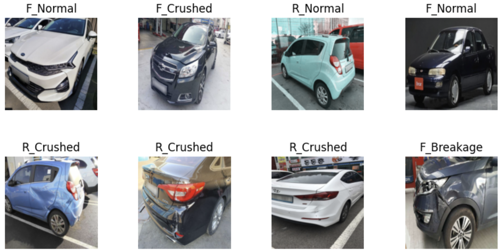

# 🚗 Neural Image Classifier – Vehicle Damage Recognition

A deep learning-based image classifier built with PyTorch and Streamlit. This app analyzes images of car fronts and rears and classifies them into one of six categories indicating damage status.

---

## 📸 Project Overview

This project is part of a neural network series focused on real-world image classification. It utilizes transfer learning with ResNet50 and a custom classifier head to predict:

- **Front Breakage**
- **Front Crushed**
- **Front Normal**
- **Rear Breakage**
- **Rear Crushed**
- **Rear Normal**

The following image show an example of the above classifications:


The dataset used for the project consists of 2300 images. All the coding details of the project can be found in the Jupuyter notebook _Classiffier_notebook.ipynb_

---

## 🧠 Model Architecture

- **Base Model**: ResNet50 (pretrained on ImageNet)
- **Custom Head**: Fully connected layers with Dropout and BatchNorm
- **Training Strategy**:
  - Layer freezing/unfreezing for layer 4
  - Early stopping on validation loss
  - Trained on labeled car images
  - Evaluation on separate test set

---

## 🖥️ App Features

- 📁 Upload an image (PNG, JPG, JPEG)
- 🧠 Neural network prediction
- 📊 Interactive probability bar chart (Plotly)
- 🧾 Prediction confidence and class name
- 💡 Clean, responsive layout using Streamlit

---

## Getting Started

## Link to streamlit online application
You can access the online version of the app in the following url: https://deeplearningproject-cardamagerecognition.streamlit.app/

###  Requirements
To install all dependencies run the following code 

```bash
pip install -r requirements.txt
```

### Run the application
To execute the application run the following code
```bash
streamlit run streamlit_app.py
```
### Contact

email: ingstorres@hotmail.com
linkedin: www.linkedin.com/in/sebastian
torres-franco-3b3000115 
